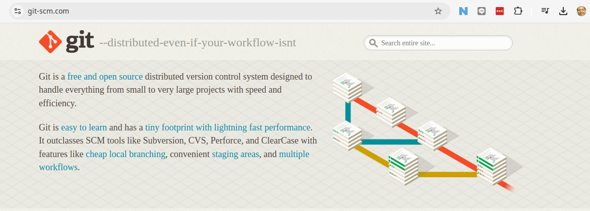

# Git LAB

## เครียมความพร้อม ติดตั้ง Git command line และ Git Bash บน windows

- สำหรับ windows สามารถ Downlaod Git terminal ได้ที่ [https://git-scm.com/](https://git-scm.com/)


เปิด Git Bash terminal


จะได้ terminal ด้านล่าง (เป็น terminal ที่รองรับ linux command) พัฒนามาจาก MINGW64 [https://www.mingw-w64.org/](https://www.mingw-w64.org/)


## Git GUI เพื่อให้การบริหารจัดการ แบบ GUI 
เราสามารถใช้งาน Git Gui ได้หลาย Software ได้แก่ 
- [https://www.gitkraken.com/](https://www.gitkraken.com/)


- VScode Extension


## LAB1 เรียนรู้ Git อย่าง ง่ายผ่านทาง Animation

[https://onlywei.github.io/explain-git-with-d3/](https://onlywei.github.io/explain-git-with-d3/)


## LAB2 เรียนรู้ Git ผ่านทาง Terminal

สำหรับ ใน lab ต่อจากนี้ไป จะทำบน git bash terminal นะครับ เพื่อความสะดวกในการใช้งาน git command line

### **step1** บอกให้ Git รู้ว่าเราเป็นใคร  การตั้งค่าชื่อผู้ใช้และอีเมล
```
$ git config --global user.name "Sawangpong Muadphet"
$ git config --global user.email "sawangpongm@gmail.com"
```
คำสั่งเหล่านี้ใช้ในการตั้งค่าชื่อผู้ใช้และอีเมลที่ Git จะใช้ในการบันทึกข้อมูลคอมมิตแต่ละครั้ง โดยมีรายละเอียดดังนี้:

- **--global** หมายความว่าการตั้งค่านี้จะมีผลกับทุก repository ในเครื่องของคุณ
- **user.name** ใช้ในการตั้งชื่อผู้ใช้
- **user.email** ใช้ในการตั้งค่าอีเมลที่ใช้ในการบันทึกคอมมิต

###  **step2** การเปิดใช้งานสีในการแสดงผล
```
$ git config --global color.ui true
$ git config --global -e
```


###  **step3** แสดงค่า config
```
$ git config --list
```


### **step4** การเริ่มต้น Repository
- 4.1 การสร้าง Repository ใหม่
ในการเริ่มต้นโปรเจกต์ใหม่ ให้สร้าง repository ใหม่โดยใช้คำสั่ง:

```
$ mkdir git_lab1
$ cd git_lab1
$ git init .
Initialized empty Git repository in C:/Users/sysadmin/git_lab1/.git/

$ ls -la
total 24
drwxr-xr-x 1 sysadmin 197121 0 Aug 12 15:47 ./
drwxr-xr-x 1 sysadmin 197121 0 Aug 12 15:46 ../
drwxr-xr-x 1 sysadmin 197121 0 Aug 12 15:47 .git/
```

- คำสั่งนี้จะสร้างโฟลเดอร์ .git ในไดเรกทอรีปัจจุบัน ซึ่งจะใช้ในการเก็บข้อมูลของ Git เป็น hidden folder เนื่องจากขึ้นต้นด้วย จุด ต้องใช้คำสั่ง `ls -la`

```
$ ls -la
total 12
drwxr-xr-x.  3 sysadmin sysadmin 4096 Aug 10 19:25 .
drwx------. 37 sysadmin sysadmin 4096 Aug 10 19:25 ..
drwxr-xr-x.  7 sysadmin sysadmin 4096 Aug 10 19:26 .git

```

- 4.2 สร้าง file
หลังจากสร้าง repository แล้ว ให้เพิ่มไฟล์เข้าไปและทำการคอมมิต:
```
$ echo "task1  create project" > tasks.txt
$ git status

On branch master

No commits yet

Untracked files:
  (use "git add <file>..." to include in what will be committed)
	tasks.txt

nothing added to commit but untracked files present (use "git add" to track)
```

**screen:** git แจ้งว่า file ที่สร้างมาใหม่ ที่ชื่อ tasks.txt ยังไม่ได้ถูก tracks และแนะนำให้ใช้คำสั่ง git add เพื่อเริ่มต้นการ Track


> Git แสดงผลเป็นสีแดงเนื่องตากยังไม่ได้มี การ Add file tasks.txt ไว้ใน state area

- 4.3 การเพิ่มไฟล์และการทำคอมมิตแรก

```
$ git add .
warning: in the working copy of 'tasks.txt', LF will be replaced by CRLF the next time Git touches it

$ git commit -m "Initial commit"
[master (root-commit) 6364659] Initial commit
 1 file changed, 1 insertion(+)
 create mode 100644 tasks.txt
```

- **git add .** ใช้ในการเพิ่มไฟล์ทั้งหมดในไดเรกทอรีปัจจุบันเข้าสู่ staging area
- **git commit -m "Initial commit"** ใช้ในการบันทึกการเปลี่ยนแปลงเป็นคอมมิต 


```admonish warning
warning: in the working copy of 'tasks.txt', LF will be replaced by CRLF the next time Git touches it

```

- 4.4 handle end of line ใน windows


windows และ mac/linux จะมีความแตกต่างกันสำหรับ endofline ดังนั้น จะต้องทำการ Config ค่าของ Git ให้ถูกต้อง


```
$ git config --global core.autocrlf input
$ git config --global --list
user.email=sawangpongm@gmail.com
user.name=Sawangpong Muadphet
color.ui=true
core.autocrlf=input
```

###  **step5**  การใช้งานคำสั่ง git log

```
$ git log
```


คำสั่งนี้จะแสดงประวัติของคอมมิตทั้งหมดใน branch ปัจจุบันใน terminal โดยรายละเอียดจะรวมถึง:

- SHA-1 ของคอมมิต
- Author: ชื่อผู้ทำคอมมิต
- Date: วันที่และเวลา
- Commit message: ข้อความคอมมิต

คำสั่ง git log ที่ต้องใช้ในอนาคต
```
$ git log <branch-name>
$ git log --oneline
$ git log --graph --oneline 
```


ตัวอย่าง การแสดงผลแบบ Graph
```
*   0e25143 (HEAD, main) Merge branch 'feature'
|\  
| * 16b36c6 Fix a bug in the new feature
| * 23ad9ad Start a new feature
* | ad8621a Fix a critical security issue
|/  
* 400e4b7 Fix typos in the documentation
* 160e224 Add the initial code base
```
Ref คำสั่ง log เพิ่มเติม [https://www.atlassian.com/git/tutorials/git-log](https://www.atlassian.com/git/tutorials/git-log)

## แก้ไขไฟล์ tasks.txt  จำลองการพัฒนา code
ลอง แก้ไขไฟล์ tasks.txt ดู
```
$ echo "task2  develop/code project" >> tasks.txt
```
และทดสอบคำสั่งต่อไปนี้ เพื่อเป็นการทบทวน
```
$ git status
```


> git แสดง modified 

```
$ git add .
$ git commit "Add develop code"
[master 60d42ba] Add develop code
 1 file changed, 1 insertion(+)

```
สั่ง คำสั่ง: 
```
$ git log
```


สั่ง คำสั่ง: `git log -p` เพื่อดูรายละเอียดของการเปลี่ยนแปลง
```
$ git log -p
```


Option -p ใช้เพื่อแสดงแพตช์ (patch) ทั้งหมดที่แสดงการเปลี่ยนแปลงที่เกิดขึ้นในแต่ละคอมมิต แทนที่จะแสดงเพียงข้อความคอมมิตและข้อมูลเมตาดาต้า การใช้ -p จะทำให้คุณเห็นบรรทัดที่ถูกเพิ่มหรือถูกลบในการคอมมิตนั้น ๆ


### **step6**   เรียนรู้คำสั่ง การสร้าง Branch
- 6.1 การสร้าง Branch ใหม่
เพื่อสร้าง branch ใหม่ ให้ใช้คำสั่ง:

รูปแบบ:
```
$ git branch branch-name
```
แทนที่ branch-name ด้วยชื่อของ branch ที่คุณต้องการสร้าง

- 6.2 การตรวจสอบ Branch
สามารถตรวจสอบรายชื่อ branch ทั้งหมดได้ด้วยคำสั่ง:

รูปแบบ:
```
$ git branch
```

Branch ที่กำลังใช้งานจะมีเครื่องหมาย * ข้างหน้า

- 6.3  การสลับ Branch
การสลับไปยัง Branch อื่น เพื่อสลับไปยัง branch อื่น ให้ใช้คำสั่ง:

รูปแบบ:
```
$ git checkout branch-name
```
หรือใช้คำสั่ง git switch เป็นคำสั่งใหม่กว่า:

รูปแบบ:
```
$ git switch branch-name
```

การสร้างและสลับไปยัง Branch ใหม่ในคำสั่งเดียว
สามารถสร้าง branch ใหม่และสลับไปที่ branch นั้นได้ด้วยคำสั่ง:

รูปแบบ:
```
$ git checkout -b branch-name
```
หรือสามารถใช้คำสั่ง  `git switch` ใช้คำสั่งใหม่กว่า:

```
$ git switch -c branch-name
```


## Git Flow branch model
Gitflow branching model เป็นการกำหนด โครงสร้างของการจัดการสถานะ (Stages) ของ การพัฒนา
ในแต่ละ project จะมี Branch หลัก (primary branch) หลักอยู่ 2 branch ที่มีอายุอยู่ตลอดไป มีมีการลบ Branch 
- `master`  ปรกติจะถูกสร้างจาก ขั้นตอนของการทำ initialization
- `develop` สร้างจาก master
จะเป็น Branch ที่คู่ขนานกัน


### สร้าง branch develop จาก master
สั่งคำสั่ง สำหรับการสร้าง branch
```
$ git branch
* master

$ git checkout -b develop master
Switched to a new branch 'develop'

$ git  branch
* develop
  master
```


เราถือว่า `origin/master` เป็น Brance จะต้องสะท้อนถึงสถานะพร้อมใช้งานจริงเสมอ Production 
เราถือว่า `origin/develop` เป็น Branch ต้องสะท้อนถึงสถานะที่มีการเปลี่ยนแปลงการพัฒนาล่าสุดสำหรับการ Release ครั้งถัดไป

เมื่อโค้ดต้นแบบในสาขา `develop` ถึงจุดเสถียรภาพและพร้อมสำหรับการปล่อย ผ่านการ Test และ แก้ไข Bug หมดแล้ว (Green)  การเปลี่ยนแปลงทั้งหมดควรจะถูก merge กลับไปยัง `master` อย่างไรก็ตาม และติดแท็กหมายเลขเวอร์ชัน วิธีการทำแบบละเอียดจะกล่าวถึงต่อไป

ดังนั้น ทุกครั้งที่มีการ merge การเปลี่ยนแปลงกลับไปยัง `master` นั่นคือการ เตรียม Release ใหม่ 

### Support Branch 
นอกจาก `master`, `develop` branch แล้ว ยังมี Branch ที่เกิดขึ้นระหว่างกระบวนการ การพัฒนา และจะถูก Delete เมื่อ merge กลับมาก ได้แก่
- **Feature Branches** ดึงมาจาก `develop` และถูก merge กับไปยัง `develop`
- **Release Branch** ดึงมาจาก `develop` และถูก merge กับไปยัง `develop`
- **Hotfix Branch** ดึงมาจาก `master` และถูก merge กับไปยัง `master`

ดึงมาจาก `develop` และถูก merge กับไปยัง `develop`


## นำคำสั่งที่เรียนรู้จากด้านบน มาทำ LAB git workflow ค่อ

สั่ง คำสั่ง: เพื่อสร้าง release branch จาก Branch develop (แนวคิดของ Git flow)

```
$ git checkout -b release/1.0.0 develop
$ echo "final release/1.0.0" >> tasks.txt
$ cat tasks.txt 

$ git add .
$ git commit -m "Final release/1.0.0"
$ git  diff develop
```


ให้กลับไป checkout develop branch 
```
$ git checkout develop
$ cat tasks.txt
task1  create project
task2  develop/code project

$ git diff release/1.0.0
```

ทำการ Merge การเปลี่ยนแปลงจาก release กลับมายัง develop
```
$ git merge develop release/1.0.0 

Updating 60d42ba..615237f
Fast-forward
 tasks.txt | 1 +
 1 file changed, 1 insertion(+)
```


check log:
```
$ git log

commit 615237f584f2b5211b17bc7a43ed0119a7eb8998 (HEAD -> develop, release/1.0.0)
Author: Sawangpong Muadphet <sawangpongm@gmail.com>
Date:   Mon Aug 12 16:38:42 2024 +0700

    Final release/1.0.0

commit 60d42ba30b398ae453192cfa2d296bbbb3e59853 (master)
Author: Sawangpong Muadphet <sawangpongm@gmail.com>
Date:   Mon Aug 12 16:17:30 2024 +0700

    Add develop code

commit 63646592a35aa67bc52681cb0b8a3ba80ce66c00
Author: Sawangpong Muadphet <sawangpongm@gmail.com>
Date:   Mon Aug 12 15:51:22 2024 +0700

    Initial commit

```


- HEAD จะชี้ ไปยัง develop , release/1.0.0 เป็นการ merge ล่าสุด