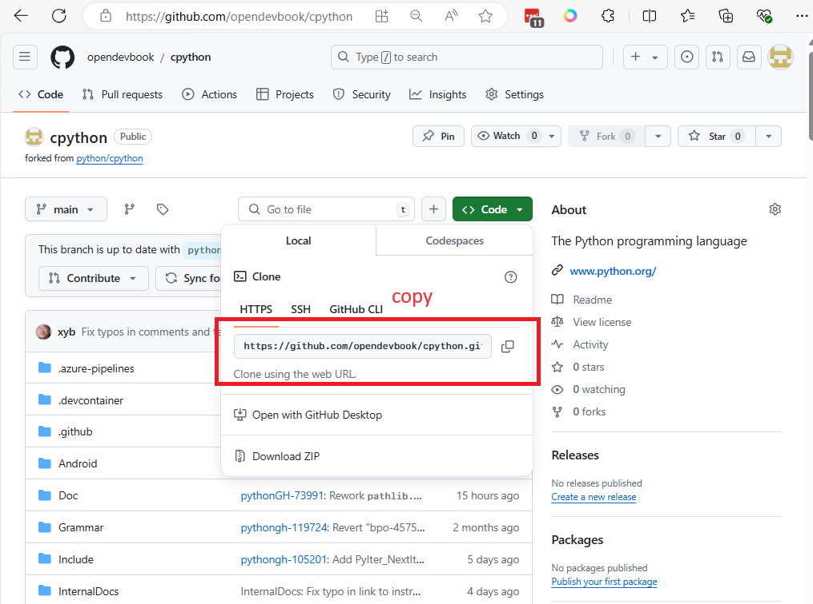

# Git workshop2

สร้าง Repository บน github


กรอกข้อมูล


ยังไม่ต้อง  `Add a README file` option จะทำให้ ได้ Reposity ที่ว่างๆ ต่อมา github จะแสดงค่า ค่า setup เพื่อให้เราไปสร้าง git remote ในเครื่อง logo


สำหรับ สร้าง repo ใหม่
```
echo "# git_lab1" >> README.md
git init
git add README.md
git commit -m "first commit"
git branch -M main
git remote add origin https://github.com/opendevbook/git_lab1.git
git push -u origin main
```

หามี Repository อยู่ แล้วก็ให้ใช้คำสั่งต่อไปนี้

```
git remote add origin https://github.com/opendevbook/git_lab1.git
git branch -M main
git push -u origin main
```
- **git remote add origin <url>** add remote repository
- **git branch -M main**  เปลี่ยนชือ branch ปัจจุบัน เป็น `main` โดย `-M` flag จะเป็นการ fore ให้เปลี่ยนชื่อ
- **git push -u origin main** ทำการ push local repository ไปยัง remote repository ใน branch ชื่อเดียวกัน กับ local และ `-u` flag ทำหน้า บอกกับ git ว่า `origin` repository จะทำหน้าที่เป็น upstream  

่ก่อนการ Apply คำสั่ง


หลังการสั่งคำสั่ง


คำว่า upstream repository (origin/main) หมายถึง repository ทำหน้าเก็บ Code ที่เป็น code หลัก และทำหน้าที่ sync กับ code ใน local git

## Git Fork model

ทดลองการ Fork repository python

Fork https://github.com/python/cpython repository

กดปุ่ม Fork 


กด `create fork`


## copy repo และ clone มายัง local repo

ให้เรา copy 


```
$ git clone https://github.com/opendevbook/cpython.git
$ cd cpython
$ git branch -r
```
> เปลี่ยน owner ให้เป็นของเรา


### เพิ่ม upstream repository

```
$ git remote -v
origin  https://github.com/opendevbook/cpython.git (fetch)
origin  https://github.com/opendevbook/cpython.git (push)

$ git branch -v

$ git remote add upstream https://github.com/python/cpython
```

- เพิ่มที่เก็บโค้ดต้นฉบับ (upstream) เป็น remote ในที่เก็บโค้ดของคุณ


### git fetch upstream
```
$ git fetch upstram
```


#### merge upstram เข้ากับ main ของ local
```
$ git merge upstream/main
```
- ผสานการเปลี่ยนแปลงจากสาขา main ของ upstream เข้ากับสาขาในเครื่องของคุณ

#### ดู commit log ของสาขา upstream
```
$ git log upstram/main
```

