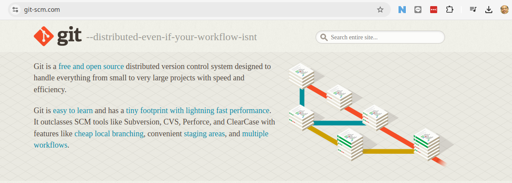
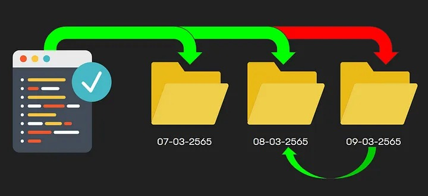
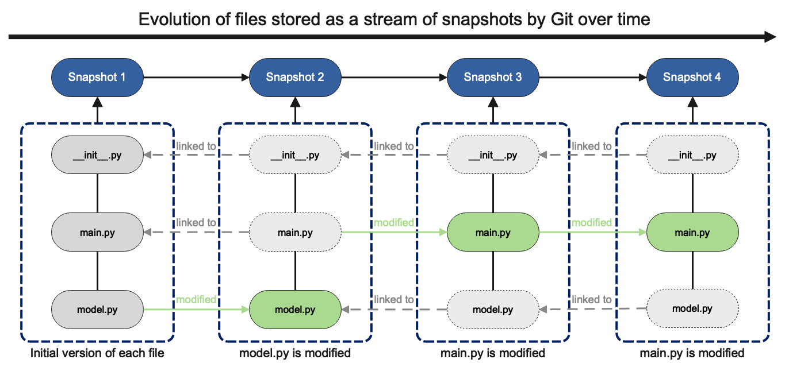
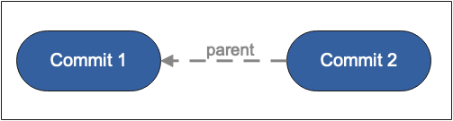
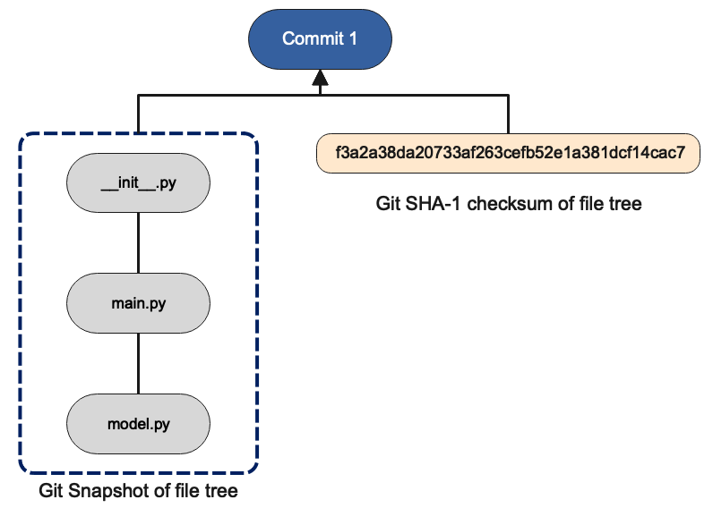
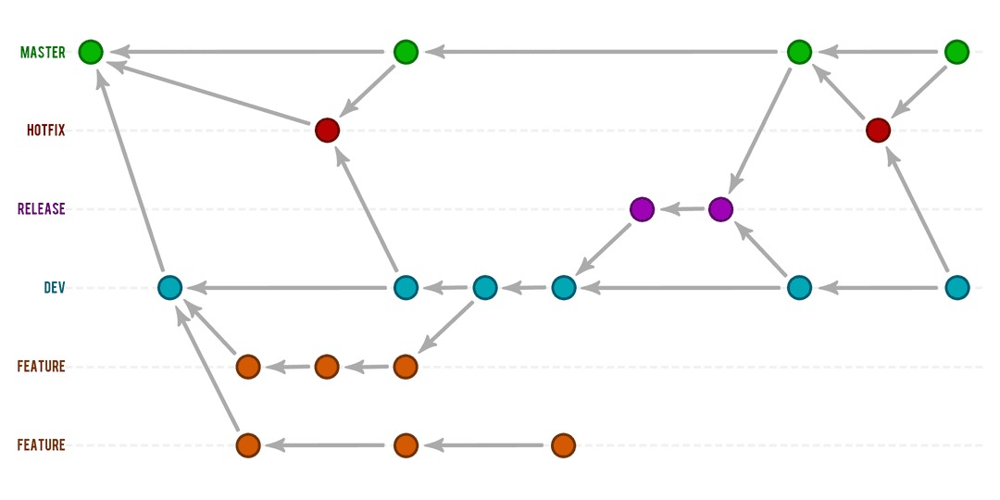

## Git คืออะไร

Git คือระบบควบคุมเวอร์ชัน (Version Control System) ที่ใช้ในการติดตามและจัดการการเปลี่ยนแปลงของโค้ดในโครงการซอฟต์แวร์ โดย Git ช่วยให้คุณสามารถบันทึกประวัติการเปลี่ยนแปลงทั้งหมดในโค้ดของคุณ ไม่ว่าจะเป็นการเพิ่ม ลบ หรือแก้ไขไฟล์ และสามารถย้อนกลับไปยังเวอร์ชันก่อนหน้าได้หากเกิดปัญหา

การพัฒนา

ปี 2005: Linus Torvalds เริ่มพัฒนา Git หลังจากที่ทีมงาน Linux kernel ประสบปัญหากับระบบควบคุมเวอร์ชันเดิมที่ใช้ชื่อว่า BitKeeper ซึ่งเปลี่ยนแปลงเงื่อนไขการใช้งาน ทำให้ Linus และทีมงานต้องการระบบใหม่ที่สามารถใช้งานได้ฟรีและเปิดเผยซอร์สโค้ด

ปี 2005 (เดือนเมษายน): Git ถูกเปิดตัวเป็นครั้งแรก และในเวลาไม่นานก็ได้รับความนิยมเนื่องจากความเร็ว ความยืดหยุ่น และการออกแบบที่เหมาะสมกับโครงการซอฟต์แวร์ขนาดใหญ่

แม้ว่า นักพัฒนาแต่ละคนสามารถ ทำงานแบบ Decentralized ได้เพราะมี repo เป็นของตัวเอง แต่ก็ยังสามารถทำงานร่วมกันแบบ Centralized ได้ โดยอ้างเอิง ด้วย repo ที่ชื่อว่า ``origin```


### การติดตั้ง Git

- Fedora, Centos
```
$ sudo dnf update -y
$ sudo dnf install git
```
- Ubuntu
```
$ sudo apt update -y
$ sudo apt install git -y
```
- สำหรับ windows สามารถ Downlaod Git terminal ได้ที่ [https://git-scm.com/](https://git-scm.com/)


### ก่อนที่จะมี Git
Copy File & Folder คือ ลักษณะการบันทึกเอกสารและแยกออกเป็นหลายๆไฟล์ แล้วตั้งชื่อไฟล์พร้อมระบุเวอร์ชั่นตามลำดับ


**ข้อเสีย :** 
- เปลืองพื้นที่จัดเก็บข้อมูลตามจำนวนเวอร์ชั่นของเอกสาร เพราะต้องคัดลอกไฟล์ทั้งโฟลเดอร์เพื่อสร้างเอกสารเวอร์ชั่นใหม่ขึ้นมา
- ไม่สามารถ ทำงานร่วมกับทีมงาน ในการแลกเปลี่ยน หรือ ทำงานระหว่างทีมงานได้
### คุณสมบัติที่สำคัญของ Git
1. **Distributed Version Control**: ทุกๆ นักพัฒนาที่ทำงานในโครงการเดียวกันจะมีสำเนาของ repository ทั้งหมดในเครื่องของตนเอง ทำให้ทุกคนสามารถทำงานได้อย่างอิสระโดยไม่ต้องพึ่งพา server กลาง

2. **Branching**: Git ช่วยให้คุณสามารถสร้างสาขา (branch) เพื่อพัฒนาฟีเจอร์ใหม่ๆ โดยไม่กระทบต่อโค้ดหลัก และเมื่อฟีเจอร์นั้นพร้อมใช้งาน คุณสามารถ merge สาขากลับไปยังสาขาหลักได้

3. **Staging Area**: Git มีพื้นที่กลางที่เรียกว่า staging area ซึ่งคุณสามารถเลือกไฟล์ที่ต้องการจะบันทึกการเปลี่ยนแปลง และค่อย commit การเปลี่ยนแปลงนั้นเข้า repository

4. **History**: Git บันทึกประวัติการเปลี่ยนแปลงทั้งหมดของโครงการ ทำให้ง่ายต่อการตรวจสอบว่าใครทำอะไร เมื่อไหร่ และทำไม


### การใช้งาน Git
- **การพัฒนาโครงการร่วมกัน**: Git ถูกใช้กันอย่างแพร่หลายในโครงการที่มีนักพัฒนาหลายคนทำงานร่วมกัน ช่วยให้การจัดการโค้ดทำได้ง่ายขึ้น ลดการเกิดข้อขัดแย้งระหว่างโค้ดของนักพัฒนาหลายคน
- **การสำรองข้อมูล**: เนื่องจากทุกคนมีสำเนาของ repository ทั้งหมดในเครื่องของตนเอง ทำให้มีการสำรองข้อมูลอยู่เสมอ
- **การติดตามและแก้ไขข้อผิดพลาด**: Git ช่วยให้คุณสามารถย้อนกลับไปยังเวอร์ชันก่อนหน้าได้อย่างง่ายดาย ทำให้การติดตามและแก้ไขข้อผิดพลาดเป็นไปอย่างมีประสิทธิภาพ

Git จึงเป็นเครื่องมือที่สำคัญมากในวงการซอฟต์แวร์และการพัฒนาต่างๆ ช่วยให้การจัดการโค้ดเป็นไปได้อย่างราบรื่นและมีประสิทธิภาพ

## Git Data Model

โมเดลข้อมูลของ Git เป็นหัวใจสำคัญที่ทำให้ Git มีความยืดหยุ่นและมีประสิทธิภาพในเรื่องการควบคุมเวอร์ชัน การทำงานร่วมกัน และการจัดการประวัติการเปลี่ยนแปลงของโค้ดในโครงการ โดยหลักๆ แล้ว โมเดลข้อมูลของ Git ประกอบด้วยส่วนสำคัญดังนี้:

### 1. Snapshots (สแนปชอต)
Git ไม่ได้จัดการกับไฟล์ในลักษณะเป็นชุดของการเปลี่ยนแปลง (deltas) เหมือนระบบควบคุมเวอร์ชันแบบเดิมๆ แต่ Git มองทุกๆ สถานะของโครงการเป็น "สแนปชอต" ซึ่งเป็นภาพรวมของไฟล์และโฟลเดอร์ในช่วงเวลาหนึ่ง หากมีการเปลี่ยนแปลงในไฟล์ใดไฟล์หนึ่ง Git จะสร้างสแนปชอตใหม่ขึ้นมาแทนที่จะบันทึกแค่การเปลี่ยนแปลงที่เกิดขึ้น

### 2. Blobs (บล๊อบส์)
ใน Git ไฟล์แต่ละไฟล์จะถูกเก็บในรูปแบบของ "blob" ซึ่งเป็นเพียงชุดข้อมูลที่เป็นไบต์ โดยไม่มีข้อมูลเกี่ยวกับชื่อไฟล์หรือโครงสร้างของไดเรกทอรี นี่หมายความว่าแต่ละ blob จะเป็นเวอร์ชันหนึ่งๆ ของไฟล์ โดยมีการจัดเก็บข้อมูลอย่างมีประสิทธิภาพและไม่ซ้ำซ้อน

### 3. Trees (ทรีส์)
"Tree" ใน Git คือโครงสร้างข้อมูลที่เก็บข้อมูลเกี่ยวกับไดเรกทอรี Tree จะทำหน้าที่จับคู่ชื่อไฟล์กับ blob ที่เกี่ยวข้อง รวมถึงสามารถจับคู่กับ tree อื่นๆ ได้ ซึ่งหมายความว่าไดเรกทอรีสามารถมีไดเรกทอรีย่อยได้อีก นี่คือวิธีที่ Git จัดการโครงสร้างของไฟล์และโฟลเดอร์ในโครงการ

### 4. Commits (คอมมิทส์)
"Commit" ใน Git คือการบันทึกสแนปชอตของโครงการในช่วงเวลาหนึ่งๆ การ commit จะเก็บข้อมูลของ tree ระดับบนสุด (ซึ่งเป็นภาพรวมของโครงสร้างไฟล์ทั้งหมด) และยังเก็บข้อมูลเพิ่มเติม เช่น ผู้ที่ทำการ commit ข้อความที่อธิบายการเปลี่ยนแปลง และการเชื่อมโยงไปยัง commit ก่อนหน้า (ถ้ามี) ซึ่งทำให้ Git สามารถสร้างประวัติของการเปลี่ยนแปลงที่เป็นลำดับต่อเนื่องได้

### 5. Branches (สาขา)
Branch ใน Git คือชี้ไปยัง commit หนึ่งๆ ซึ่งทำให้คุณสามารถทำงานในส่วนของโค้ดได้อย่างเป็นอิสระจากส่วนอื่นๆ โดยเมื่อคุณสร้าง branch ใหม่ Git จะสร้าง pointer ใหม่ที่ชี้ไปยัง commit ปัจจุบัน และเมื่อคุณทำการ commit ใน branch นั้น pointer จะถูกอัพเดตให้ชี้ไปยัง commit ล่าสุด

### 6. Tags (แท็กส์)
Tag ใน Git คือ pointer ที่ไม่เปลี่ยนแปลง ซึ่งมักใช้ในการทำเครื่องหมาย commit สำคัญ เช่น การปล่อยเวอร์ชันของซอฟต์แวร์ Tags จะถูกใช้ในการอ้างอิง commit ที่เฉพาะเจาะจงโดยไม่คำนึงถึง branch ที่มันอยู่

```
<root> (tree)
|
+- foo (tree)
|  |
|  + bar.txt (blob, contents = "hello world")
|
+- baz.txt (blob, contents = "git is wonderful")

```
- root คือ Top folder ที่ต้องการ Track
- Tree  คื Folder
- blob คือ File


### สรุป
โมเดลข้อมูลของ Git ถูกออกแบบมาเพื่อให้การติดตามและจัดการโค้ดเป็นไปอย่างมีประสิทธิภาพและยืดหยุ่น โดยการมองโครงการในรูปแบบของสแนปชอตและใช้โครงสร้างข้อมูลที่มีประสิทธิภาพในการจัดการไฟล์และโฟลเดอร์ ทำให้ Git สามารถรองรับการทำงานร่วมกันในโครงการขนาดใหญ่ได้อย่างดี


## การจำลองประวัติ (History): การเชื่อมโยงสแนปชอต (Snapshot)


### การเชื่อมโยงสแนปชอตควรทำอย่างไร?
ในระบบควบคุมเวอร์ชัน วิธีหนึ่งที่ง่ายที่สุดในการเชื่อมโยงสแนปชอตคือการใช้ประวัติแบบเส้นตรง (linear history) ซึ่งประวัติจะเป็นรายการของสแนปชอตที่เรียงตามลำดับเวลา วิธีนี้เป็นแบบจำลองที่เข้าใจง่ายและตรงไปตรงมา แต่ Git ไม่ใช้วิธีนี้เนื่องจากข้อจำกัดหลายประการ

### ประวัติใน Git: Directed Acyclic Graph (DAG)
ใน Git ประวัติของโครงการถูกจัดการเป็นกราฟแบบไม่วนกลับ (Directed Acyclic Graph หรือ DAG) ของสแนปชอต ซึ่งฟังดูอาจเหมือนคำศัพท์ทางคณิตศาสตร์ที่ซับซ้อน แต่จริงๆ แล้วแนวคิดนี้ไม่ยากเลย

#### กราฟแบบไม่วนกลับ (DAG) คืออะไร?
DAG หมายความว่าแต่ละสแนปชอตใน Git จะมีการอ้างอิงถึงชุดของ "Parent" ซึ่งเป็นสแนปชอตที่เกิดขึ้นก่อนหน้า โดย "parent" เหล่านี้สามารถมีได้มากกว่าหนึ่งชุด เนื่องจากการ Merge Process ซึ่งเกิดจากการที่สแนปชอตอาจมีที่มาจากหลายสาขา (branch) ที่ถูกพัฒนาไปพร้อมกันแล้วถูกนำมารวมกัน (merge) ในภายหลัง



### คอมมิต (Commit)
ใน Git สแนปชอตเหล่านี้ถูกเรียกว่า "คอมมิต" (commit) คอมมิตแต่ละตัวจะเก็บข้อมูลเกี่ยวกับสถานะของโครงการ ณ จุดหนึ่งๆ ในเวลา พร้อมกับข้อมูลเกี่ยวกับพาเรนท์ที่มันอ้างอิงถึง การมองเห็นประวัติของคอมมิตใน Git จึงเป็นเหมือนการมองเห็นกราฟที่มีหลายเส้นทาง ซึ่งบางเส้นทางอาจมาบรรจบกันในภายหลังหลังจากการทำงานร่วมกัน

คอมมิต (commit) ใน Git คือสแนปชอตของโครงสร้างไฟล์ทั้งหมดใน repository ของคุณ ณ ช่วงเวลาหนึ่ง คอมมิตจะบันทึกสถานะของไฟล์และไดเรกทอรีทั้งหมดในขณะนั้น ทำให้คุณสามารถย้อนกลับไปยังสถานะเดิมได้หากต้องการ

- ### การรับประกันความสมบูรณ์ของข้อมูลด้วย SHA-1
เพื่อให้แน่ใจว่าโครงสร้างไฟล์ที่ถูกบันทึกในคอมมิตสะท้อนถึงสถานะจริงของโครงการในช่วงเวลานั้นอย่างถูกต้องและไม่มีการเปลี่ยนแปลงโดยไม่ได้ตั้งใจ Git จะสร้างค่าเช็คซัม (checksum) แบบ SHA-1 สำหรับคอมมิตแต่ละครั้ง

- ### SHA-1 Checksum คืออะไร?
SHA-1 เป็นอัลกอริธึมที่ใช้ในการสร้างค่าเช็คซัมซึ่งเป็นสตริงที่ประกอบด้วยตัวอักษร 40 ตัวในรูปแบบฐานสิบหก (hexadecimal) ค่าเช็คซัมนี้ถูกคำนวณจากเนื้อหาของไฟล์และโครงสร้างของไดเรกทอรีใน repository ซึ่งหมายความว่าหากมีการเปลี่ยนแปลงใดๆ ในไฟล์หรือโครงสร้างไดเรกทอรี ค่า SHA-1 ที่สร้างขึ้นจะเปลี่ยนไปด้วย

- ### SHA-1 ในทุกคอมมิต
ค่า SHA-1 นี้จะถูกเก็บไว้ในคอมมิตแต่ละตัว ทำให้คุณสามารถตรวจสอบความสมบูรณ์และความถูกต้องของข้อมูลในคอมมิตได้ตลอดเวลา ค่าตรวจสอบนี้ทำให้มั่นใจได้ว่าโครงสร้างไฟล์ในคอมมิตยังคงอยู่ในสภาพเดิมที่ถูกบันทึกไว้เมื่อสร้างคอมมิตนั้น คุณสามารถเห็นค่า SHA-1 นี้ได้ในคอมมิตทุกครั้งตามที่แสดงในภาพตัวอย่างต่อไปนี้:



### การแสดงภาพของประวัติใน Git
ถ้าจะให้เข้าใจง่ายขึ้น ลองนึกภาพประวัติของโครงการใน Git เป็นเหมือนกราฟที่มีจุด (nodes) ซึ่งแทนสแนปชอตต่างๆ และเส้น (edges) ที่เชื่อมต่อจุดเหล่านี้แทนการอ้างอิงถึงพาเรนท์ กราฟนี้จะแผ่ขยายออกไปในหลายทิศทาง เนื่องจากการพัฒนาโค้ดอาจมีการแตกสาขา (branch) และการรวม (merge) จากสาขาต่างๆ ทำให้โครงสร้างของประวัติใน Git มีความซับซ้อนและยืดหยุ่นกว่าการจัดการประวัติแบบเส้นตรง


## Git Branch คืออะไร?



### ความหมายของ Branch ใน Git
Branch ใน Git เปรียบเสมือน "เส้นทางการพัฒนา" หรือ "กิ่งก้าน" ของโค้ด ที่แยกออกมาจากเส้นทางหลัก (main branch หรือ master branch) การสร้าง Branch ใหม่ช่วยให้คุณสามารถทำงานกับโค้ดในลักษณะคู่ขนานได้ โดยไม่ส่งผลกระทบต่อโค้ดใน Branch หลัก คุณสามารถพัฒนาฟีเจอร์ใหม่ๆ แก้ไขข้อผิดพลาด หรือทดลองไอเดียใหม่ๆ ได้อย่างอิสระ

### การทำงานของ Branch
เมื่อคุณสร้าง Branch ใหม่ Git จะสร้าง pointer ที่ชี้ไปยังคอมมิตปัจจุบันที่คุณทำงานอยู่ และจากนั้นคุณสามารถเริ่มทำงานใน Branch นั้นได้โดยการทำคอมมิตต่างๆ ใน Branch ของคุณโดยเฉพาะ เมื่อคุณทำการ commit ใน Branch ใหม่ pointer ของ Branch จะอัพเดตให้ชี้ไปยังคอมมิตล่าสุดที่คุณทำไว้

### การสลับระหว่าง Branch
Git ช่วยให้คุณสามารถสลับไปมาระหว่าง Branch ต่างๆ ได้อย่างง่ายดายโดยใช้คำสั่ง `git checkout` หรือ `git switch` การสลับ Branch จะเปลี่ยนสถานะของไฟล์ในโฟลเดอร์ทำงานของคุณให้ตรงกับสแนปชอตล่าสุดของ Branch ที่คุณเลือกสลับไป ซึ่งหมายความว่าคุณสามารถทำงานในหลายๆ สายการพัฒนาได้โดยไม่ต้องกังวลว่าโค้ดจาก Branch หนึ่งจะส่งผลต่ออีก Branch หนึ่ง

### การรวม Branch (Merging)
เมื่อคุณทำงานใน Branch ใหม่เสร็จเรียบร้อยและต้องการรวมโค้ดของคุณเข้ากับ Branch หลัก (หรือ Branch อื่น) คุณสามารถใช้คำสั่ง `git merge` เพื่อรวมการเปลี่ยนแปลงจาก Branch นั้นเข้ากับ Branch ที่คุณเลือก Git จะพยายามรวมการเปลี่ยนแปลงเหล่านั้นเข้าด้วยกันโดยอัตโนมัติ แต่หากมีความขัดแย้ง (conflict) ในโค้ด Git จะขอให้คุณแก้ไขความขัดแย้งนั้นก่อนการรวมจะเสร็จสมบูรณ์

### การลบ Branch
หลังจากที่คุณรวม Branch เข้ากับ Branch อื่นแล้ว และไม่ต้องการใช้งาน Branch นั้นอีก คุณสามารถลบ Branch ได้โดยใช้คำสั่ง `git branch -d` หรือ `git branch -D` หาก Branch นั้นยังไม่ได้ถูกรวม (unmerged) การลบ Branch ที่ไม่จำเป็นจะช่วยลดความซับซ้อนของโครงการและช่วยให้การจัดการโค้ดเป็นระเบียบมากขึ้น

### สรุป
Branch ใน Git เป็นเครื่องมือที่ทรงพลังที่ช่วยให้การพัฒนาโค้ดเป็นไปอย่างยืดหยุ่นและมีประสิทธิภาพ การใช้งาน Branch ทำให้นักพัฒนาสามารถทำงานในหลายๆ สายการพัฒนาได้อย่างอิสระโดยไม่ส่งผลกระทบต่อโค้ดหลัก และสามารถรวมการเปลี่ยนแปลงเหล่านั้นเข้าด้วยกันได้เมื่องานเสร็จสมบูรณ์
